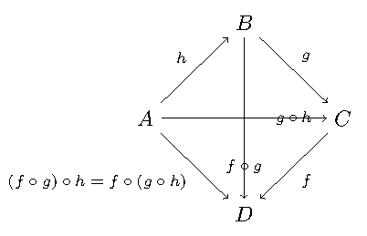
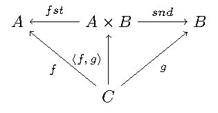
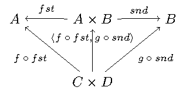
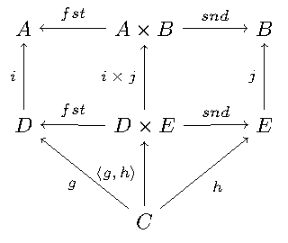
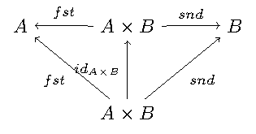
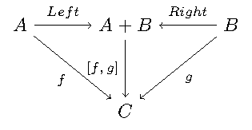
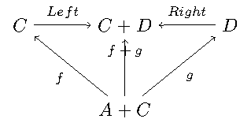
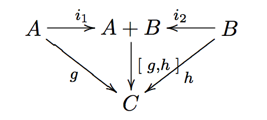
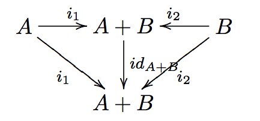
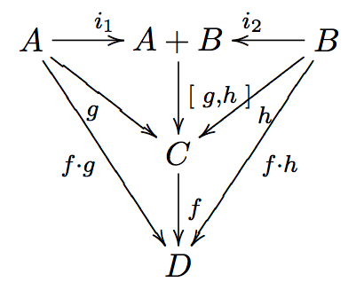

# credits

Harold Carr  
@haroldcarr  
  
\vspace{0.9in}
*Program Design by Calculation*   
J. N. Oliveira  
[<http://www4.di.uminho.pt/~jno/>](http://www4.di.uminho.pt/~jno/)

# function definition

**math**

**haskell**

    f :: Integer -> Integer
    f 0 = 1
    f n = f (n - 1) * n

# function application

**math**

**haskell**

    f 5

# function definition/application

example **Factorial.hs**

# function composition (1/3)

# function composition (2/3)

1.       :BMCOL:

    
    **math**
    \[ f \circ g \]
    \[ f(g(x)) \]
    
    **haskell**
    
        (.) :: (b -> c) -> (a -> b) -> a -> c
        (.) f g = \x -> f (g x)

2.       :BMCOL:

    
    

# function composition (3/3)

example **Composition.hs**

# purity viz application/composition

example **CompositionVizPurity.java**

\vspace{0.2in}

example **CompositionVizPurity.hs**

# composition is associative

\hspace{1in} \((f \circ g) \circ h = f \circ (g \circ h)\)

Similar to \((a + b) + c = a + (b + c)\)

# identity function(s) (1/2)

`id :: a -> a`  
`id x = x`

does not lose any information

*unit* of composition : \(f \circ id = id \circ f = f\)

similar to \hspace{4.5em} \(n + 0 = 0 + n = n\)

# identity function(s) (2/2)

example **Identity.hs**

# constant function(s)

    const     :: a -> b -> a
    const x _ =  x

loses all information (i.e., ignores arg)

    c :: a -> Char
    c  = const 'c'

example **Const.hs**

# id/const functions are limit points

`id` preserves all information  
\vspace{0.1in}
`const` loses all information  
\vspace{0.1in}
others functions lose info  
\vspace{0.1in}
functional programming:

-   transforming or losing info to fit context

# constant-fusion

`constantFusion :: (a->b) -> a -> c`  
`constantFusion f = c . f`

-   input to `f` can be any type
-   result of `f` can be any type
-   ignores result of `f`
-   output of constant-fusion not (necessarily) type related to co/domain of `f`

example **ConstantFusion.hs**

# isomorphisms \hspace{5em} \(A \cong B\)

Given             \hspace{4em} \(f : A \rightarrow B\),  
\(f\) has *inverse* \hspace{0.5em} \(f^{\circ} : B \rightarrow A\),  
such that         \hspace{2em} \(f \circ f^{\circ} = id_b \wedge f^{\circ} \circ f = id_a\)   
\vspace{0.1in}
isomorphisms convert between "formats" without losing info  
\vspace{0.1in}
isomorphic domains regarded as "abstractly" the same  
\vspace{0.1in}
example **Isomorphisms.hs**

# products : gluing uncomposable funs

cartesian product of types

    pair :: (c -> a) -> (c -> b)
            -> c     -> (a, b)
    pair f g c = (f c, g c)

\(\langle f,g \rangle : C \rightarrow A \times B\)   
\(\langle f,g \rangle c = (f \hspace{0.25em} c, g \hspace{0.25em} c)\)   
\vspace{0.1in}
example **Products.hs** \hspace{3em} \fontsize{11pt}{11.5}\selectfont (goto coproducts)

# \(\times\)-cancellation

    fst (1,2)  =>  1
    snd (1,2)  =>  2

\hspace{3em} \fontsize{11pt}{11.5}\selectfont (goto \(+\) cancellation)

# \(\times\) of two functions

when domains nor ranges do not coincide  
\vspace{0.1in}
\(f \times g = \langle f \circ fst, g \circ snd \rangle\)   
\vspace{0.1in}

example **Product.hs** \fontsize{11pt}{11.5}\selectfont (goto \(+\) of two funs)

# \(\times\)-fusion \(\langle g,h \rangle \circ f = \langle g \circ f, h \circ f \rangle\)

example **ProductFusion.hs** \fontsize{11pt}{11.5}\selectfont (goto \(+\)-fusion)

Pair : right-distributive with rspt to \(\circ\)

# \(\times\)-absorption (1/3)

left-distributivity does not hold but

for \(f \circ \langle g,h \rangle\) when \(f = i \times j\) :
\((i \times j) \circ \langle g,h \rangle = \langle i \circ g,j \circ h \rangle\)

<table border="2" cellspacing="0" cellpadding="6" rules="groups" frame="hsides">

<colgroup>
<col  class="left" />

<col  class="left" />

<col  class="left" />
</colgroup>
<tbody>
<tr>
<td class="left">&#xa0;</td>
<td class="left">&#xa0;</td>
<td class="left">\((i \times j) \circ \langle g,h \rangle\)</td>
</tr>

<tr>
<td class="left">\(\times\) 2 \(f\)</td>
<td class="left">=</td>
<td class="left">\(\langle i \circ fst, j \circ snd \rangle \circ \langle g,h \rangle\)</td>
</tr>

<tr>
<td class="left">\(\times\)-fus</td>
<td class="left">=</td>
<td class="left">\(\langle (i \circ fst) \circ \langle g, h \rangle,(j \circ snd) \circ \langle g,h \rangle \rangle\)</td>
</tr>

<tr>
<td class="left">\(\circ\) ass</td>
<td class="left">=</td>
<td class="left">\(\langle i \circ (fst \circ \langle g, h \rangle),j \circ (snd \circ \langle g,h \rangle) \rangle\)</td>
</tr>

<tr>
<td class="left">\(\times\)-can</td>
<td class="left">=</td>
<td class="left">\(\langle i \circ g,j \circ h \rangle\)</td>
</tr>
</tbody>
</table>

# \(\times\)-absorption (just derived) (2/3)

\fontsize{11pt}{11.5}\selectfont (goto \(+\)-absorption)

# \(\times\)-absorption (3/3)

example **ProductAbsorption.hs**

# \(\times\) and projections

previous diagram shows  
\vspace{0.2in}
\(i \circ fst = fst \circ (i \times j)\)

-   given \(D \times E\) no need to evaluate \(j\)

\(j \circ snd = snd \circ (i \times j)\)

-   given \(D \times E\) no need to evaluate \(i\)

\vspace{0.2in}
example **ProductAndProjections.hs**

# functorial properties of \(\times\)

 
\(\times\)-functor : \((g \circ h) \times (i \circ j) = (g \times i) \circ (h \times j)\)

-   bi-distribution of \(\times\) with respect to \(\circ\)
-   example **ProductFunctor.hs** \fontsize{11pt}{11.5}\selectfont (goto \(+\)-functor)

\(\times\)-functor-id : \(id_A \times id_B = id_{A \times B}\)

    product id id ("x", 'y') => ("x", 'y')
            id    ("x", 'y') => ("x", 'y')

\fontsize{11pt}{11.5}\selectfont (goto \(+\)-functor-id)

# \(\times\)-reflexion : \(\langle fst,snd \rangle = id_{A \times B}\)

    pair fst snd ("x", 'y') => ("x", 'y')
    id           ("x", 'y') => ("x", 'y')

\fontsize{11pt}{11.5}\selectfont (goto \(+\)-reflexion)

# \(\times\) is commutative : \(A \times B \cong B \times A\)

\fontsize{15.5pt}{16}\selectfont

\(\langle snd,fst \rangle = swap\)

<table border="2" cellspacing="0" cellpadding="6" rules="groups" frame="hsides">

<colgroup>
<col  class="left" />

<col  class="left" />

<col  class="left" />
</colgroup>
<tbody>
<tr>
<td class="left">&#xa0;</td>
<td class="left">&#xa0;</td>
<td class="left">\(swap \circ swap\)</td>
</tr>

<tr>
<td class="left">def swap</td>
<td class="left">=</td>
<td class="left">\(\langle snd,fst \rangle \circ swap\)</td>
</tr>

<tr>
<td class="left">\(\times\)-fusion</td>
<td class="left">=</td>
<td class="left">\(\langle snd \circ swap,fst \circ swap \rangle\)</td>
</tr>

<tr>
<td class="left">def swap</td>
<td class="left">=</td>
<td class="left">\(\langle snd \circ \langle snd,fst \rangle, fst \circ \langle snd,fst \rangle \rangle\)</td>
</tr>

<tr>
<td class="left">\(\times\)-cancel</td>
<td class="left">=</td>
<td class="left">\(\langle fst,snd \rangle\)</td>
</tr>

<tr>
<td class="left">\(\times\)-reflexion</td>
<td class="left">=</td>
<td class="left">\(id\)</td>
</tr>
</tbody>
</table>

Therefore, no information is lost (or gained) when swapping fields in record datatypes.

# \(\times\) is associative (1/2) \hspace{2em} exercise

given

    al :: (a, (b, c)) -> ((a,  b),c)
    ar :: ((a, b),c)  ->  (a, (b, c))

prove \(A \times (B \times C) \cong (A \times B) \times C\)

\fontsize{15.5pt}{16}\selectfont

    (ar . al) ('a',('b','c')) => ('a',('b','c'))
    id        ('a',('b','c')) => ('a',('b','c'))

# \(\times\) is associative (2/2) \hspace{2em} proof

\fontsize{11pt}{11.5}\selectfont

\(al = \langle \langle fst, fst \circ snd \rangle, snd \circ snd \rangle\)   
\(ar = \langle fst \circ fst, \langle snd \circ fst, snd \rangle \rangle\)

<table border="2" cellspacing="0" cellpadding="6" rules="groups" frame="hsides">

<colgroup>
<col  class="left" />

<col  class="left" />

<col  class="left" />
</colgroup>
<tbody>
<tr>
<td class="left">&#xa0;</td>
<td class="left">=</td>
<td class="left">\((ar \circ al) (a, (b, c))\)</td>
</tr>

<tr>
<td class="left">al def</td>
<td class="left">=</td>
<td class="left">\((ar \circ \langle \langle fst      ,  fst \circ snd \rangle            ,  snd \circ snd \rangle) (a, (b, c))\)</td>
</tr>

<tr>
<td class="left">pair def</td>
<td class="left">=</td>
<td class="left">\((ar \circ (       \langle fst      ,  fst \circ snd \rangle (a, (b, c)), (snd \circ snd) (a, (b, c))   )\)</td>
</tr>

<tr>
<td class="left">\(\times\)-can</td>
<td class="left">=</td>
<td class="left">\((ar \circ (       \langle fst      ,  fst \circ snd \rangle (a, (b, c)),                         c     )\)</td>
</tr>

<tr>
<td class="left">pair def</td>
<td class="left">=</td>
<td class="left">\((ar \circ (        (fst (a, (b, c)), (fst \circ snd) (a, (b, c)) ),                              c     )\)</td>
</tr>

<tr>
<td class="left">\(\times\)-can</td>
<td class="left">=</td>
<td class="left">\((ar \circ (        (     a         ,                      b      ),                              c     )\)</td>
</tr>

<tr>
<td class="left">&#xa0;</td>
<td class="left">=</td>
<td class="left">&#x2026;</td>
</tr>

<tr>
<td class="left">&#xa0;</td>
<td class="left">=</td>
<td class="left">\((a, (b, c))\)</td>
</tr>
</tbody>
</table>

# coproducts : gluing un \(\circ\) funs (1/2)

*coproduct* of \(A\) and \(B\) is *disjoint union* : values labeled with
`Left` or `Right` to indicate the value came from \(A\) or \(B\)

\([f,g] : A + B \rightarrow C\)

\fontsize{11pt}{11.5}\selectfont (goto products)

# coproducts (2/2)

example **Either.hs**

# *product* and *coproduct* are *dual*

Duality means

-   everything said about
    -   product \(A \times B\)
-   can be rephrased to
    -   coproduct \(A + B\).

e.g., : sum of two functions `f + g`   
\hspace{0.5em} is dual of   
\hspace{1em} product of two functions `f × g`

# \(+\) of two functions

\(f + g = [Left \circ f, Right \circ g]\)

example **Sum.hs** \fontsize{11pt}{11.5}\selectfont (goto \(\times\) of two funs)

# \(+\)-cancellation

\([g,h] \circ Left = g\)   
\vspace{0.1in}
\([g,h] \circ Right = h\)

example **SumCancellation.hs** \fontsize{11pt}{11.5}\selectfont (goto \(\times\) cancellation)

# \(+\)-reflexion

\([ Left, Right ] = id_{A + B}\)

example **SumReflexion.hs** \fontsize{11pt}{11.5}\selectfont (goto \(\times\)-reflexion)

# \(+\)-fusion

\(f \circ [ g , h ] = [ f \circ g , f \circ h ]\)

example **SumFusion.hs**  \fontsize{11pt}{11.5}\selectfont (goto \(\times\)-fusion)

# \(+\)-absorption

\([ g , h ] \circ ( i + j ) = [ g \circ i, h \circ j ]\)

example **SumAbsorption.hs** \fontsize{11pt}{11.5}\selectfont (goto \(\times\)-absorption)

# \(+\)-functor (1/2)

\((g \circ h) + (i \circ j) = (g + i) \circ (h + j)\)

\fontsize{11pt}{11.5}\selectfont (goto \(\times\)-functor)

# \(+\)-functor (2/2)

\((g \circ h) + (i \circ j) = (g + i) \circ (h + j)\)

example **SumFunctor.hs**

# \(+\)-functor-id

\(id_A + id_B = id_{A+B}\)

    sumFunctorIdLeft, sumFunctorIdRight
           :: Either a b -> Either a b
    sumFunctorIdLeft  = sum id id
    sumFunctorIdRight = id

\fontsize{11pt}{11.5}\selectfont (goto \(\times\)-functor-id)

# mixing products and coproducts

pair/either exchange maps  
\vspace{0.1in}
coproduct (\(A + B\)) to   
\vspace{0.1in}
\hspace{0.5em} product (\(A' \times B'\))

\vspace{0.2in}

\([ \langle f , g \rangle , \langle h , k \rangle ] = \langle [ f , h ], [ g , k ] \rangle\)

\vspace{0.2in}

example **pairEitherExchange.hs**

# summary

-   purity
-   application, composition
-   equational reasoning
-   patterns of transformations
-   *lots* more in the paper
-   <http://www4.di.uminho.pt/~jno/ps/pdbc_part.pdf>
-   we made it to p. 30/285 (theorem 2.47)

# slides and code

\fontsize{13pt}{13}\selectfont
<http://bit.ly/2015-lambda-conf-harold-carr>

\vspace{0.3in}

\fontsize{6pt}{6}\selectfont
<https://github.com/haroldcarr/learn-haskell-coq-ml-etc/tree/master/haskell/book/Program_Design_by_Calculation-Oliveira/2015-LambdaConf>