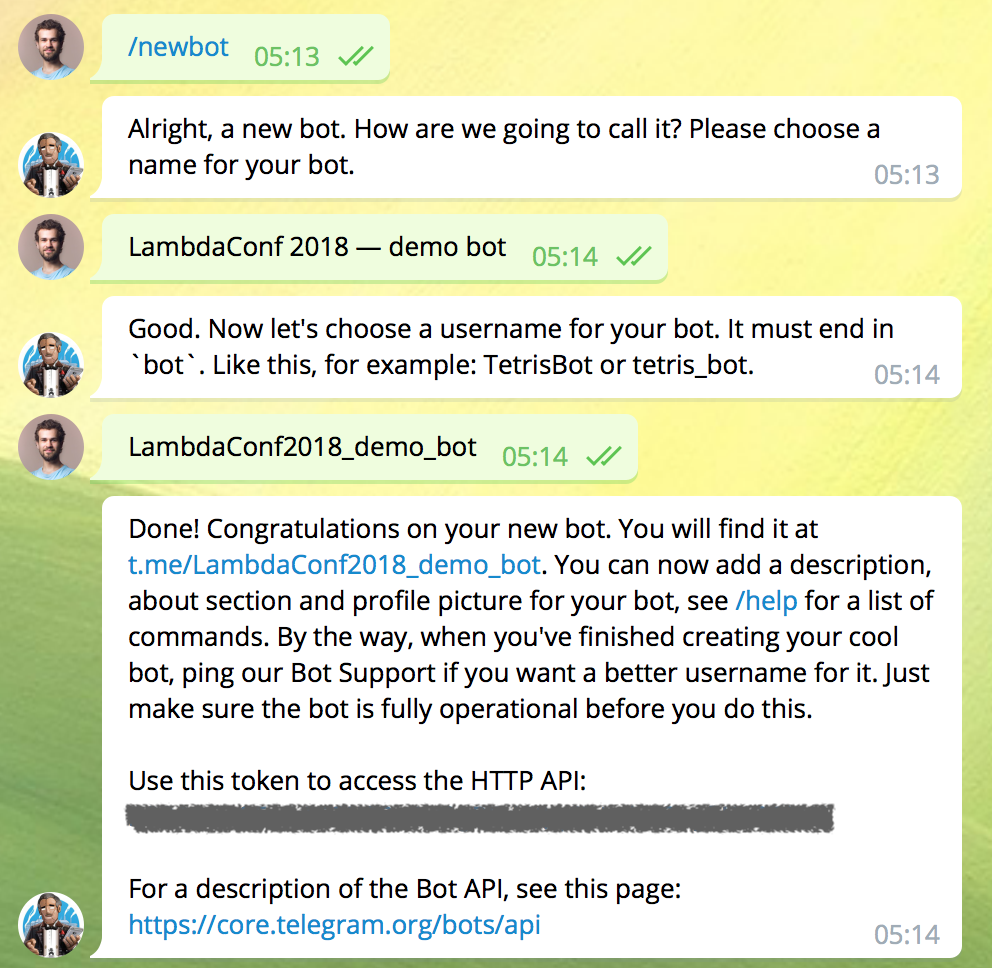

How to prepare for the workshop
===============================

So you want to learn how to build your own Telegram bot with Haskell?
Let's get you started!

## Get materials

First of all, clone this repository:

```sh
git clone https://github.com/fizruk/lambdaconf-2018-workshop.git
```

For the rest of this document I assume that you work
from the root directory of cloned repository.

## Install Haskell

For the purpose of this workshop we are going to use
[the Stack tool](https://docs.haskellstack.org/en/stable/README/)
to manage our Haskell project and install compiler and dependencies for us.

### Stack

To install Stack on Un*x operating systems all you need to do is run

```sh
curl -sSL https://get.haskellstack.org/ | sh
```

or

```sh
wget -qO- https://get.haskellstack.org/ | sh
```

On Windows, you can download and install the
[Windows 64-bit Installer](https://www.stackage.org/stack/windows-x86_64-installer).

### GHC

Stack manages your GHC installations and
you can tell it to install GHC with a simple command:

```sh
stack setup
```

This step will download and install GHC 8.2.2 on your computer.

### Building dependencies

To build a bot we need a few important dependency libraries installed.
To install all dependencies and build demo project run:

```
stack build
```


Stack builds dependencies from sources, so this step can take a while first time
(up to 20 mins).

### Install `ghcid` (optional)

To facilitate development and get immediate type checks for your code,
install a lightweight `ghcid` tool:

```
stack install ghcid
```

You can now run `ghcid` and it will perform compilation
and type-checking for you on the fly! Just run it in a separate terminal window:

```
ghcid
```

## Setup Telegram bot

To run a Telegram bot you need to create one first, by asking
[BotFather](https://telegram.me/botfather) — a specialised bot
that allows you to create new bots!



Be sure to save your newly created bot token (masked on the screenshot)!
You will need it to operate your bot during the workshop.

## Join Gitter.im chat room

[](https://gitter.im/lambdaconf-2018-workshop/Lobby)

If you want to discuss things with other workshop attendees or ask questions before/after workshop,
feel free to join a dedicated [chat room on Gitter.im](https://gitter.im/lambdaconf-2018-workshop/Lobby).

## Come to the workshop

That's it! You're all set up and ready for the workshop :)

Some other things to consider:

- make sure your laptop is charged (or that you have a power cord with you);
- it might be easier for you to test your bot on a smartphone, so make sure you have Telegram installed on your phone.
